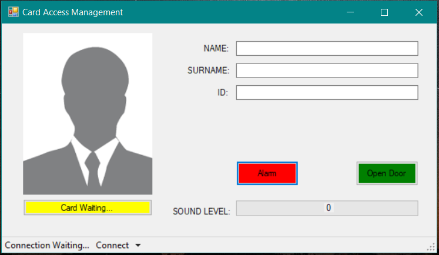

<br/>
<p align="center">
  <a href="https://github.com/ebekirbayar/RFID-Card-Access-Management-with-STM32F407-and-USB-HID-Communication-Windows-Form-Integration">
    
  </a>

  <h3 align="center">RFID Card Access Management with STM32F407 and USB HID Communication (Windows Form Integration)</h3>

  <p align="center">
    This project presents an advanced RFID card access management system developed using the STM32F407 microcontroller and USB HID communication protocol. The system allows for seamless integration with Windows-based applications, offering robust access control functionalities through a user-friendly interface.
    <br/>
    <br/>
    <a href="https://github.com/ebekirbayar/RFID-Card-Access-Management-with-STM32F407-and-USB-HID-Communication-Windows-Form-Integration">View Demo</a>
    .
    <a href="https://github.com/ebekirbayar/RFID-Card-Access-Management-with-STM32F407-and-USB-HID-Communication-Windows-Form-Integration/issues">Report Bug</a>
    .
    <a href="https://github.com/ebekirbayar/RFID-Card-Access-Management-with-STM32F407-and-USB-HID-Communication-Windows-Form-Integration/issues">Request Feature</a>
  </p>
</p>

   

## Table Of Contents

* [About the Project](#about-the-project)
* [Built With](#built-with)
* [Getting Started](#getting-started)
  * [Prerequisites](#prerequisites)
  * [Installation](#installation)
* [Usage](#usage)
* [Contributing](#contributing)
* [License](#license)
* [Authors](#authors)
* [Acknowledgements](#acknowledgements)

## About The Project

<p align="center">
    
</p>

## Features
* Communication between STM32F407 Discovery and MFRC522 RFID reader via USB HID protocol.
* Custom C# application for interfacing with the STM32F407 Discovery board.
* Reading RFID tags and processing the data on the computer.
Visual feedback on the computer interface.

## Built With

* STM32CubeIDE: Development environment for STM32F407 Discovery firmware.
* C#: Used for developing the desktop application for communication with the STM32F407 Discovery board.
* USBLibrary: Library for USB HID communication.
* MFRC522 Library: Library for interfacing with the MFRC522 RFID reader module.
* .NET Framework: Required for running the C# desktop application.
* STM32F407 Discovery Board: Hardware platform for firmware development.
* MFRC522 RFID Reader Module: Hardware component for RFID tag reading.
* USB Cable: For connecting the STM32F407 Discovery board to the computer.

## Getting Started

<p align="center">
    
</p>

To get started with this project, follow these steps:

### Prerequisites

* STM32F407 Discovery development board.
* MFRC522 RFID reader module.
* USB cable for connecting STM32F407 Discovery to the computer.
* Development environment for STM32F407 Discovery (e.g., STM32CubeIDE).
* .NET Framework for running the C# application on the computer.

### Installation

#### Hardware Setup
1. Connect the STM32F407 Discovery board to the computer via USB cable.
2. Connect the MFRC522 RFID reader module to the appropriate pins on the STM32F407 Discovery board.

#### Software Setup
1. Set up the development environment for STM32F407 Discovery and compile/upload the provided firmware to the board.
2. Install the necessary drivers for the STM32F407 Discovery board to function as a USB HID device.
3. Ensure that the .NET Framework is installed on the computer for running the C# application.


4. Clone the repo

```sh
git clone https://github.com/ebekirbayar/RFID-Card-Access-Management-with-STM32F407-and-USB-HID-Communication-Windows-Form-Integration.git
```
```JS
this.devicePort.ProductId = Int32.Parse("7D0", System.Globalization.NumberStyles.HexNumber);
this.devicePort.VendorId = Int32.Parse("3E9", System.Globalization.NumberStyles.HexNumber);
```
* ProductId: This represents a unique identifier assigned to the product (device) by the manufacturer. It distinguishes the device from others of the same vendor. In this code snippet, the ProductId is set to "7D0" in hexadecimal format.

* VendorId: This represents the unique identifier assigned to the vendor (manufacturer) of the device. It helps the operating system identify which driver to use for communication with the device. In this code snippet, the VendorId is set to "3E9" in hexadecimal format.


## Usage

* Compile and upload the firmware to the STM32F407 Discovery board.
* Run the provided C# application on the computer.
* Connect the STM32F407 Discovery board to the computer via USB cable.
* Use the C# application to interact with the STM32F407 Discovery board and read RFID tags through the MFRC522 RFID reader.
* Visual feedback on the C# application interface will indicate the status of the RFID tag readings and device connections.

## Contributing

Contributions are what make the open source community such an amazing place to be learn, inspire, and create. Any contributions you make are **greatly appreciated**.
* If you have suggestions for adding or removing projects, feel free to [open an issue](https://github.com/ebekirbayar/RFID-Card-Access-Management-with-STM32F407-and-USB-HID-Communication-Windows-Form-Integration/issues/new) to discuss it, or directly create a pull request after you edit the *README.md* file with necessary changes.
* Please make sure you check your spelling and grammar.
* Create individual PR for each suggestion.
* Please also read through the [Code Of Conduct](https://github.com/ebekirbayar/RFID-Card-Access-Management-with-STM32F407-and-USB-HID-Communication-Windows-Form-Integration/blob/main/CODE_OF_CONDUCT.md) before posting your first idea as well.

### Creating A Pull Request

##### Contributing to RFID Card Access Management with STM32F407 and USB HID Communication Windows Form Integration

* Thank you for considering contributing to RFID Card Access Management with STM32F407 and USB HID Communication Windows Form Integration! Follow the steps below to contribute:

1. Fork the Project: Click the "Fork" button in the top-right corner of the GitHub repository page to create a copy of the project in your GitHub account.

2. Create your Feature Branch: Open a terminal or command prompt and navigate to the directory where you want to clone the repository. Then, run the following command to create a new feature branch:

```sh
git checkout -b feature/YourAmazingFeature
```

Replace "YourAmazingFeature" with a descriptive name for your feature or the issue you're addressing.

3. Commit your Changes: Make your desired changes to the project files. After making changes, stage them for commit using the following command:

```sh
git add .
```
Then, commit your changes with a descriptive message:

```sh
git commit -m 'Add some AmazingFeature'
```
Replace "Add some AmazingFeature" with a brief description of the changes you've made.

4. Push to the Branch: Once your changes are committed, push your changes to your forked repository on GitHub:

```sh
git push origin feature/YourAmazingFeature
```

This will push your feature branch to your forked repository.

5. Open a Pull Request: Go to the RFID Card Access Management repository on GitHub and switch to the branch you just pushed. Click the "New Pull Request" button to open a new pull request. Provide a descriptive title and detailed description of your changes in the pull request.

That's it! Your pull request will be reviewed by the project maintainers, and any necessary feedback or changes will be discussed there.

Thank you for contributing to RFID Card Access Management with STM32F407 and USB HID Communication Windows Form Integration!

## License

Distributed under the MIT License. See [LICENSE](https://github.com/ebekirbayar/RFID-Card-Access-Management-with-STM32F407-and-USB-HID-Communication-Windows-Form-Integration/blob/main/LICENSE) for more information.

## Authors

* **Ebubekir BAYAR** - *Computer Engineer* - [Ebubekir BAYAR](https://github.com/ebekirbayar/)

## Acknowledgements

* [The developers of the USB Library used for USB HID communication.]()
* [The creators of the STM32F407 Discovery development board.]()
* [The designers of the MFRC522 RFID reader module.]()
* [Open-source contributors for libraries and tools used in this project.]()
